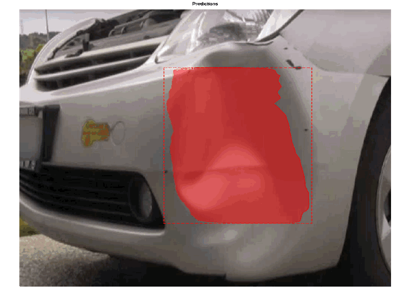
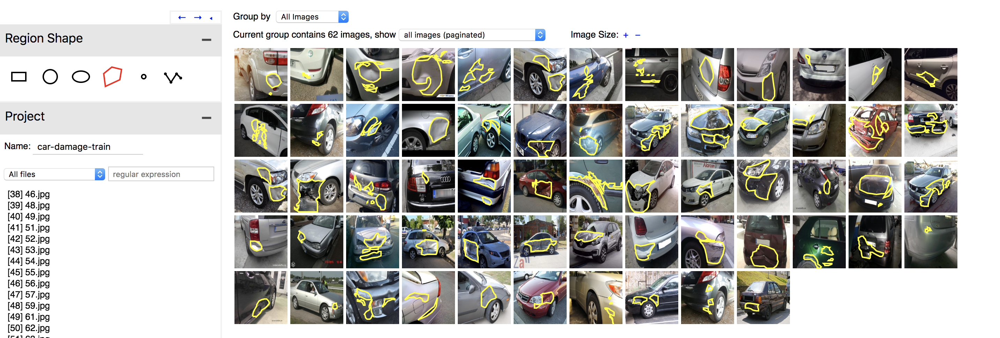

# Using Mask R-CNN to detect Car Damage
Using the amazing Matterport's [Mask_RCNN](https://github.com/nicolasmetallo/Mask_RCNN) implementation and following Priya's [example](https://www.analyticsvidhya.com/blog/2018/07/building-mask-r-cnn-model-detecting-damage-cars-python/), I trained an algorithm that highlights areas where there is damage to a car (i.e. dents, scratches, etc.). You can run the step-by-step notebook in Google Colab or use the following:
```
Usage: import the module (see Jupyter notebooks for examples), or run from
       the command line as such:

    # Train a new model starting from pre-trained COCO weights
    python3 custom.py train --dataset=/path/to/dataset --weights=coco

    # Resume training a model that you had trained earlier
    python3 custom.py train --dataset=/path/to/dataset --weights=last

    # Train a new model starting from ImageNet weights
    python3 custom.py train --dataset=/path/to/dataset --weights=imagenet

    # Apply color splash to an image
    python3 custom.py splash --weights=/path/to/weights/file.h5 --image=<URL or path to file>

    # Apply color splash to video using the last weights you trained
    python3 custom.py splash --weights=last --video=<URL or path to file>
"""
```



## Gather training data
Use the [google-images-download](https://github.com/hardikvasa/google-images-download) library or look manually for images in Google Images or Flickr. I chose Flickr and filter by the photos allowed for 'commercial and other mod uses'. I downloaded 80 images into the 'images' folder.

## Installation
This script supports Python 2.7 and 3.7, although if you run into problems with TensorFlow and Python 3.7, it might be easier to just run everything from Google Colaboratory notebook.

## Clone this repository
````
$ git clone https://github.com/nicolasmetallo/car-damage-detector.git
````

## Install pre-requisites
```
$ pip install -r requirements.txt
```

## Split dataset into train, val, test
Run the 'build_dataset.py' script to split the 'images' folder into train, val, test folders.
```
$ python3 build_dataset.py --data_dir='images' --output_dir='dataset'
```

## Annotate images
There's no standard way to annotate images, but the [VIA tool](http://www.robots.ox.ac.uk/~vgg/software/via/via_demo.html) is pretty straightforward. It saves the annotation in a JSON file, and each mask is a set of polygon points. Here's a [demo](http://www.robots.ox.ac.uk/~vgg/software/via/via_demo.html) to get used to the UI and the parameters to set. Annotate the images in the 'train' and 'val' folders separately. Once you are done, save the exported 'via_region_data.json' to each folder.



## Train your model
We download the 'coco' weights and start training from that point with our custom images (transfer learning). It will download the weights automatically if it can't find them. Training takes around 4 mins per epoch with 10 epochs.
```
$ python3 custom.py --dataset='dataset' --weights=coco # it will download coco weights if you don't have them
```

## Google Colaboratory
### Mount Google Drive
```
# Install the PyDrive wrapper & import libraries.
# This only needs to be done once in a notebook.
!pip install -U -q PyDrive
from pydrive.auth import GoogleAuth
from pydrive.drive import GoogleDrive
from google.colab import auth
from oauth2client.client import GoogleCredentials

# Authenticate and create the PyDrive client.
# This only needs to be done once in a notebook.
auth.authenticate_user()
gauth = GoogleAuth()
gauth.credentials = GoogleCredentials.get_application_default()
drive = GoogleDrive(gauth)
```

### Save trained model to Google Drive
As the weights file is around 250 mb, you are not able to download it directly from Colab. You need to save it first to your Google Drive, and then download it you your local drive. Modify with your own variable names and paths.
```
# Create & upload a file.
uploaded = drive.CreateFile({'title': path/to/weights/file.h5})
uploaded.SetContentFile('file.h5')
uploaded.Upload()
print('Uploaded file with ID {}'.format(uploaded.get('id')))
```

### Load weights file from Google Drive
```
# Mount Drive folder
from google.colab import drive
drive.mount('/content/drive')
# Look for 'mask_rcnn_damage_0010.h5' and copy to the working directly
!cp 'drive/My Drive/mask_rcnn_damage_0010.h5' 'car-damage-detector'
```

# Apply color splash to an image
```
$ python3 custom.py splash --weights=logs/damage20181007T0431/mask_rcnn_damage_0010.h5 --image=dataset/test/67.jpg
```
or run ```inspect_custom_model.ipynb```
